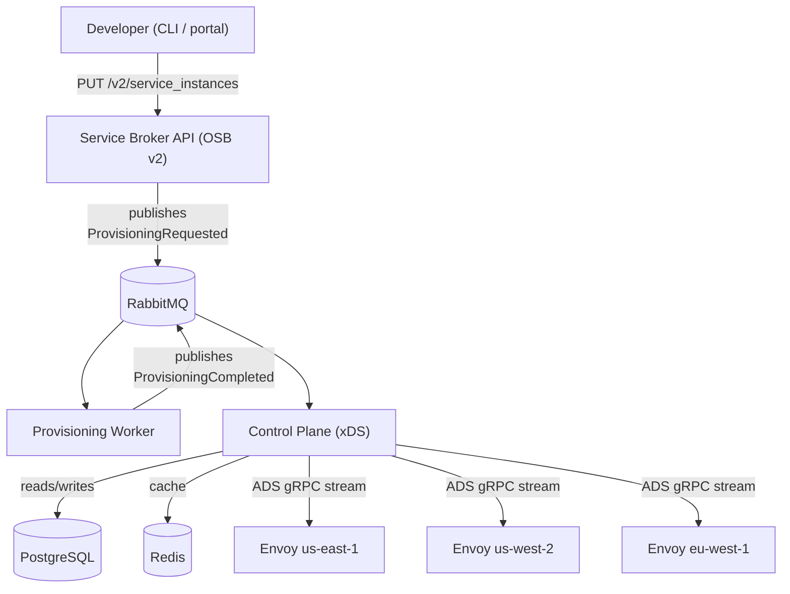
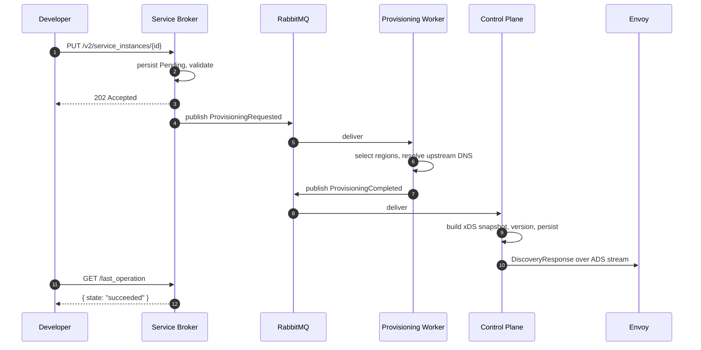

# Open Edge Platform

A self-service, Envoy-based edge load-balancing platform built around the Open Service Broker
API. Application teams provision routing on demand; an async pipeline turns each request into a
versioned xDS snapshot that the control plane hot-pushes to every connected Envoy proxy — no
restarts, no central ops queue.

> This is a learning implementation inspired by the internal platform Vasilios Syrakis built
> over 8 years at Atlassian, described in his YouTube talk *"I was laid off by Atlassian"*
> (May 2026). Architecture and component split mirror his description. Full credit to him for
> open-sourcing the knowledge.

---

## Architecture



### Provisioning sequence



---

## Components

| Component               | Responsibility                                                           | Port(s)      | Tech                            |
| ----------------------- | ------------------------------------------------------------------------ | ------------ | ------------------------------- |
| **Service Broker**      | OSB v2 REST API; validates, persists, publishes provisioning events      | 8080         | ASP.NET Core 8, EF Core, MassTransit |
| **Provisioning Worker** | Resolves upstreams, picks regions, builds EdgeResourceAllocation         | —            | .NET Worker, MassTransit         |
| **Control Plane**       | Translates allocations into xDS; ADS gRPC server; REST inspection API    | 8081, 18000  | ASP.NET Core 8, gRPC, Redis, EF |
| **ProxyConfig**         | Strongly-typed xDS v3 models + fluent snapshot builder                   | —            | .NET library                     |
| **Envoy**               | Edge L7 proxy; receives config over ADS                                  | 10000, 9901  | Envoy v1.29                      |

---

## Quick start

Prereqs: Docker 20+, Docker Compose, .NET 8 SDK (or .NET 9 — the repo builds against both).

```bash
git clone https://github.com/your-org/open-edge-platform.git
cd open-edge-platform
docker-compose up --build
```

When the stack is up:

| URL                            | What                                                  |
| ------------------------------ | ----------------------------------------------------- |
| http://localhost:8080/health   | Service Broker health                                 |
| http://localhost:8080/swagger  | Service Broker Swagger UI                             |
| http://localhost:8081/health   | Control Plane health                                  |
| http://localhost:8081/api/proxies | Connected Envoy nodes                             |
| http://localhost:15672         | RabbitMQ management (guest/guest)                     |
| http://localhost:9901          | Envoy admin (config_dump, stats, listeners)           |

Provision a test instance:

```bash
./scripts/provision-example.sh demo-1 api.example.com
```

You should see logs in the broker, the worker pick up the event, the control plane build a
snapshot, and (if Envoy is connected) a `DiscoveryResponse` flow to the proxy. Inspect Envoy's
view of the config:

```bash
curl -s http://localhost:9901/config_dump | jq '.configs[] | .name? // ._?'
```

Deprovision:

```bash
./scripts/deprovision-example.sh demo-1
```

---

## Manual provisioning (curl)

```bash
curl -X PUT \
  "http://localhost:8080/v2/service_instances/demo-1?accepts_incomplete=true" \
  -H "X-Broker-API-Version: 2.17" \
  -H "Content-Type: application/json" \
  -d '{
    "service_id": "svc-edge-lb",
    "plan_id": "standard",
    "parameters": {
      "upstream_service": "my-service.default.svc.cluster.local",
      "upstream_port": 8080,
      "hostname": "api.example.com",
      "listener_port": 443
    }
  }'
```

Poll the operation:

```bash
curl -s \
  "http://localhost:8080/v2/service_instances/demo-1/last_operation" \
  -H "X-Broker-API-Version: 2.17"
```

---

## Repo layout

```
open-edge-platform/
├── src/
│   ├── ServiceBroker/      # OSB v2 REST API (Core / Infrastructure / Api)
│   ├── Provisioning/       # MassTransit-backed background worker
│   ├── ControlPlane/       # xDS ADS gRPC server + REST inspection API
│   └── ProxyConfig/        # Shared xDS v3 models + fluent snapshot builder
├── tests/                  # xUnit unit + integration tests
├── infra/
│   ├── envoy/              # Envoy bootstrap + Dockerfile
│   └── k8s/                # Kubernetes manifests
├── docs/                   # Architecture, getting-started, self-service guide, ADRs
├── scripts/                # Demo provision/deprovision curl scripts
├── docker-compose.yml      # Full local stack
└── OpenEdgePlatform.sln
```

---

## Development

```bash
dotnet restore
dotnet build OpenEdgePlatform.sln
dotnet test  OpenEdgePlatform.sln
```

To generate or update EF migrations:

```bash
dotnet ef migrations add <Name> \
  --project src/ServiceBroker/ServiceBroker.Infrastructure/ServiceBroker.Infrastructure.csproj \
  --startup-project src/ServiceBroker/ServiceBroker.Api/ServiceBroker.Api.csproj \
  --output-dir Persistence/Migrations
```

---

## Documentation

- [Architecture deep dive](docs/architecture.md)
- [Getting started](docs/getting-started.md)
- [Self-service guide for developers](docs/self-service-guide.md)
- ADRs:
  - [001 - Why Envoy + xDS](docs/adr/001-envoy-xds.md)
  - [002 - Why async provisioning](docs/adr/002-async-provisioning.md)
  - [003 - Why OSB v2](docs/adr/003-osb-api.md)
  - [004 - Why MassTransit abstraction](docs/adr/004-masstransit-abstraction.md)

---

## Contributing

Issues and PRs welcome. Please read the ADRs first to understand the design constraints — most
"obvious" simplifications have been considered and rejected for documented reasons.

## License

MIT. The architecture this implements is described publicly by Vasilios Syrakis in his
YouTube talk *"I was laid off by Atlassian"* (May 2026); this is an independent learning
implementation written from that description. No proprietary Atlassian code is involved.
