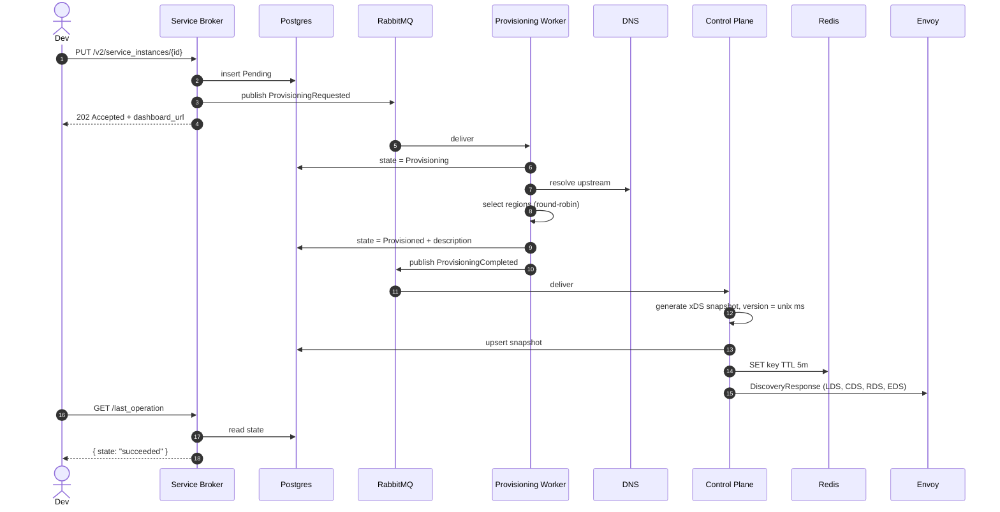

# Architecture

## Goals

The platform exists to **eliminate the central ops queue** for edge load-balancing rule changes
inside a large engineering org. Before the platform, every new public hostname, every routing
tweak, and every TLS rotation required a ticket to a load-balancer team that was the bottleneck
for hundreds of product teams. After, every team self-services through an API.

Concretely, the system must:

1. Accept a **declarative** description of "route hostname X to upstream service Y on port Z".
2. Produce that routing on a **fleet of Envoy proxies** without restarting them.
3. Apply changes **within seconds**, fleet-wide.
4. Be **idempotent** (re-applying the same desired state is a no-op).
5. **Survive partial failures** — a stuck worker should not stall others.

## Component dependency graph

```
ServiceBroker.Api ──► ServiceBroker.Infrastructure ──► ServiceBroker.Core ──┐
                                                                            │
Provisioning.Worker ──► Provisioning.Core ──► ProxyConfig.Core ◄────────────┤
                                              ▲                             │
ControlPlane.Api ──► ControlPlane.Infrastructure ──► ControlPlane.Core ─────┤
                                                                            │
                                              ProxyConfig.Infrastructure ◄──┘
```

`*.Core` is the dependency-light heart of every service. `*.Infrastructure` adds DB / cache /
bus / external IO. `*.Api` / `*.Worker` are the runnable hosts.

## Flow: provisioning



## Why these boundaries

- **Broker is sync-bounded**: it returns within a few ms, regardless of how long the actual
  provisioning takes. This isolates client SLAs from worker availability.
- **Worker can be horizontally scaled** without coordination: round-robin region selection has
  a process-local cursor, but global distribution converges quickly because all workers consume
  from the same queue.
- **Control plane is the single source of truth** for what xDS configuration a proxy *should*
  have. Proxies are dumb — they apply whatever ADS streams them.
- **Persistence in the control plane** is what makes the system survive a control-plane restart:
  on startup, the in-memory state is empty, but as Envoy proxies reconnect and send their first
  `DiscoveryRequest`, the service reads from Postgres (with Redis cache) and re-streams the
  current snapshot.

## xDS resource naming

All resource names are deterministic functions of the OSB instance id:

| Resource          | Pattern                                       |
| ----------------- | --------------------------------------------- |
| Listener          | `listener_{instanceId}`                       |
| Cluster           | `cluster_{sanitized-upstream}_{instanceId}`   |
| RouteConfig       | `route_{instanceId}`                          |
| VirtualHost       | `vh_{instanceId}`                             |

Determinism matters because it lets the control plane perform a *full* re-publish without
needing to remember which proxies saw which version of which resource — Envoy will diff against
its current view and apply only the changes.

## Failure model

| Failure                          | Containment                                              |
| -------------------------------- | -------------------------------------------------------- |
| Worker crashes mid-provision     | Message redelivered; idempotency keys avoid double-apply |
| Control plane crashes            | New leader (or restarted instance) replays from DB on next Envoy connect |
| Envoy proxy goes offline         | Removed from in-memory set; no-op until it reconnects    |
| Postgres unavailable             | Broker returns 503 to new provisions; in-flight retries  |
| Redis unavailable                | Control plane falls back to DB — observed via logs       |
| RabbitMQ unavailable             | Broker rejects new provisions; in-flight events parked   |

## Why JSON-typed `Any` in DiscoveryResponse

A full Envoy interop story requires the upstream `envoy.config.*` protobuf bundle (~thousands
of `.proto` files). For a learning repository, the cost-of-inclusion outweighs the value — so
this implementation:

1. Uses the upstream service / package name (`envoy.service.discovery.v3.AggregatedDiscoveryService`)
   so a real Envoy client completes the gRPC handshake.
2. Encodes resources inside `google.protobuf.Any` as **JSON bytes** rather than upstream proto
   bytes — meaning a real Envoy will receive but not apply them.

To run with real interop, swap `Wrap<T>` in `AdsGrpcService` to serialize as the upstream
protobuf type matching each `TypeUrl`. ADR-001 covers the tradeoffs.

## Observability

- Every service emits structured Serilog logs with `service`, `instance_id`, `event_id` enriched.
- OpenTelemetry traces span the full chain (Broker → MQ → Worker → MQ → Control Plane → gRPC).
- Prometheus scraping endpoint on both API hosts at `/metrics`.

## Read further

- [ADR 001 — Why Envoy + xDS](adr/001-envoy-xds.md)
- [ADR 002 — Why async provisioning](adr/002-async-provisioning.md)
- [ADR 003 — Why OSB v2](adr/003-osb-api.md)
- [ADR 004 — Why MassTransit abstraction](adr/004-masstransit-abstraction.md)
